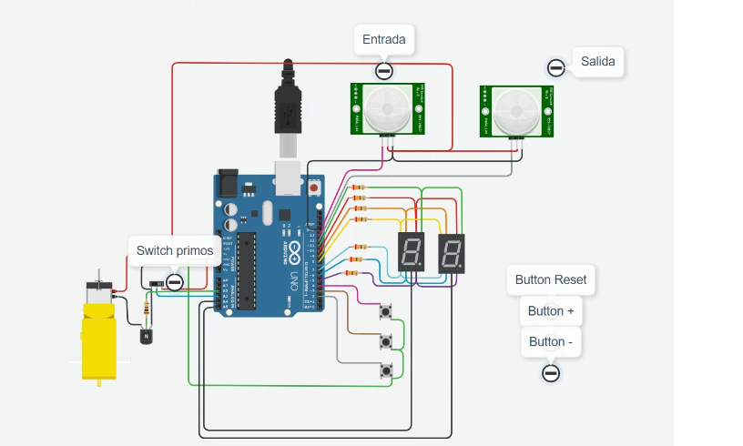

# SPD-parcial-domiciliario-parte-uno
 Parcial parte uno
 Parcial parte dos
# Documentación 

## Integrantes 
- Rivero Leandro Adriel
- Geraldine Ventura Riveros
- Stadelman German Ariel

## Proyecto: Parte 1: Contador de 0 a 99 con Display 7 Segmentos y Multiplexación.

## Proyecto: Parte 2:Contador de productos en una cinta // switch numero primos

## Descripción
//descripcion parte 1
Nos permite sumar digitos uno a uno entre 0 a 99 o descontar, ofreciendo la oportunidad de resetear nuestro contador si es necesario.
//Descripcion parte 2
Se agrego 2 sensores de movimiento (entrada\salida) 1 motor aficionado(simulando una cinta transpportadora) 1 INTERRUPTOR deslizante switch
con el objetivo de que podamos simular que es un sector de una cantera, donde tenemos que llevar piedras del punto A para ser tratadas o depositadas en el punto B para que luego interactua de la forma que se deba

este sector que pretendemos simular se encarga de contar las entradas de las piedras o productos y las salidas de los mismos, frenando la cinta transportadora cuando la salida marque contador = 0.
Dejando los botones para presetear la tarea o correjir algun error  de manera manual que pueda generar los sensores o simplemente frenando con el reset la cinta transportadora de una manera manual.
 
## Función principal
Esta funcion se encarga de evaluar los tiempos entre pulsadores para evitar el ghosting, y permite cuando son pulsados sumar o restar o resetear nuestros digitos en los display de siete segmentos.

Definimos los alias para los puertos entrada/salida usando constantes
int const A = 10; //segmento A ,int const B = 11; //segmento B (...) asociandolo a pines de la placa arduino.

Parte 2:
Al agregar el switch podemos utilizar gran parte del codigo anterior para poder sumar o restar en uno a una solo con los numeros primos y mostrarlo por los display

Ademas se agrego el motor que se enciende si hay aalgun producto (contador>0) en la cinta transoportadora

(Breve explicación de la función)

~~~ C (lenguaje en el que esta escrito)
!void visualidarDigitos()
{
  //Si ya pasó el tiempo de espera para realizar un cambio en el multiplexado, procede a hacerlo
  if((millis()- espera_display) >= delay_display )
  {
    
  	if(digitoAMostrar == unidad)//pregunto si debo mostrar la unidad
    {
    	digitalWrite(DU, LOW);
  		digitalWrite(DD, LOW);
  		printDigit(contador%10);//Para obtener la unidad del contador utilizo el resto de dividir por 10
  		digitalWrite(DU, HIGH);
    }
    
    if(digitoAMostrar == decena)//pregunto si debo mostrar la decena
    {
    	digitalWrite(DU, LOW);
  		digitalWrite(DD, LOW);
  		printDigit(contador/10);//para obtener la decena del contador simplemente lo divido por 10
  		digitalWrite(DD, HIGH);
    }
 	if(digitoAMostrar == unidad)digitoAMostrar = decena;//si mostró unidad, cambio la referencia para que muestre unidad
    else digitoAMostrar = unidad;// y vicerversa
      
    espera_display = millis();//recargo el valor de referencia para la espera para multiplexado
  }
}

//Función para convertir un número a la codificación del display
void printDigit(int digit)
{
  //apago todos los led
  digitalWrite(A, HIGH);
  digitalWrite(B, HIGH);
  digitalWrite(C, HIGH);
  digitalWrite(D, HIGH);
  digitalWrite(E, HIGH);
  digitalWrite(F, HIGH);
  digitalWrite(G, HIGH);
  //con el swich encenderé solo los digitos necesarios para mostrar el número en cada caso
  switch (digit)
}

~~~
PARTE 2
~~~ C (lenguaje en el que esta escrito)

PARTE 2 CODIGO
void loop()
{
  //Si ya pasó el tiempo de espera para presionar tecla accede a la lectura
  if( millis()- espera_tecla > delay_tecla && (digitalRead(reset) == LOW || digitalRead(b_suma) == LOW || digitalRead(b_resta) == LOW ))
  {
    espera_tecla = millis(); //recargo el valor de referencia para la espera
    if(digitalRead(reset) == LOW)contador = 0;//aplica reset al contador(no depende edl switch)
    
    if(digitalRead(primo) == LOW) //Si el switch est{a en estado bajo procede normalmente
    { 
    	if(digitalRead(b_suma) == LOW && contador < 99) contador++;//suma si el contador no llegó a 99
    	if(digitalRead(b_resta) == LOW && contador > 0)contador--;//resta si el contador no llegó a 0
    }
    
   	else// Si el switch está en alto

{
     
     if(contador >= 0 && contador <= 2)//Por condiciones especiales pregunto por si el contador está entre 0 o 2
     {
		if(contador == 0 && digitalRead(b_suma) == LOW)contador =1;//Si es cero y se suma, automáticamente lw pongo 1
       	else
        {
         	if(digitalRead(b_suma) == LOW ) contador = 3; //Si es 1 o 2 y se suma, lo fijo en 3    
     		if(digitalRead(b_resta) == LOW)contador = 1;  //Si se resta lo  fijo en 1      
        }

     }
      
     else//Si el numero es mayor a 3
     {
         -
  
  if( millis()- espera_sensor > delay_sensor && ( digitalRead(s_salida)== HIGH || digitalRead(s_entrada)== HIGH))
  {
    espera_sensor = millis();
    if(digitalRead(s_salida)== HIGH)contador--;
    if(digitalRead(s_entrada)== HIGH)contador++;
  }
  
  if(contador > 0) digitalWrite(motor,HIGH);
  else             digitalWrite(motor,LOW);
  

~~~
## :robot: Link al proyecto
- [proyecto](https://www.tinkercad.com/things/3tJoK7UXKvG)
- 
## :tv: Link al video del proceso
- [video]()

---
### Fuentes
 - https://www.tinkercad.com/things/kwAQG3PnFxu
 - https://www.tinkercad.com/things/gmqJkd4W7Xb
 - https://hetpro-store.com/TUTORIALES/arduino-millis/

